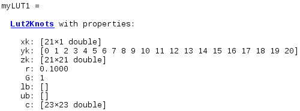
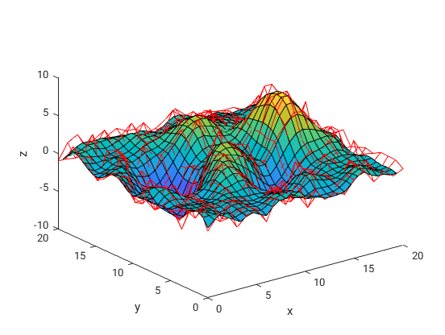
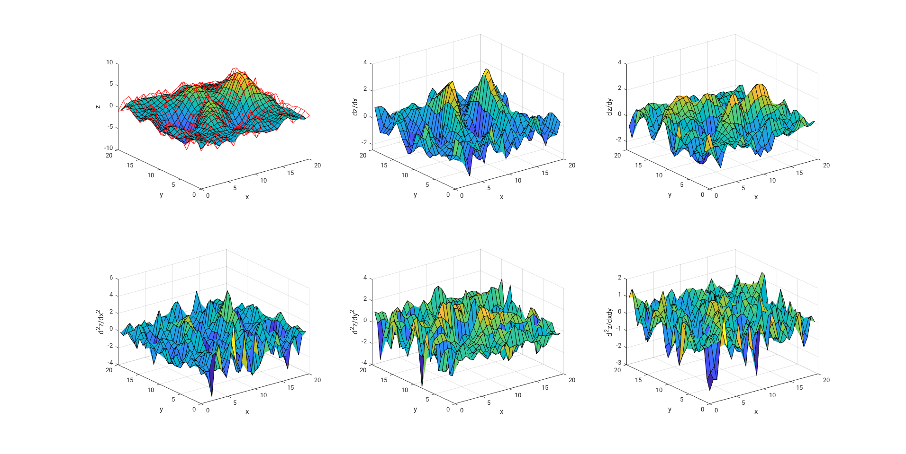
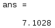
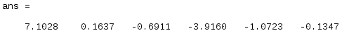
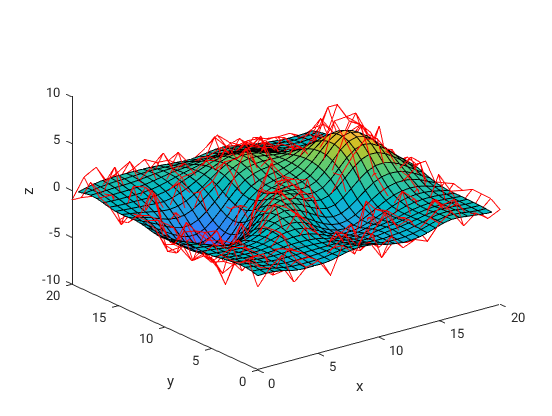
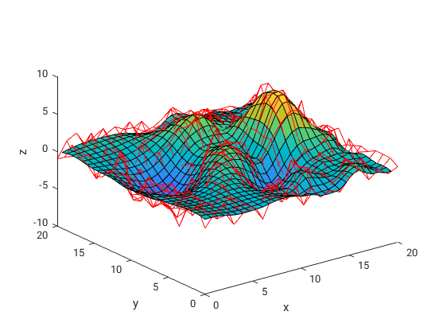

# smoothLUT and Lut2Vhdl

The MATLAB class **smoothLUT** generates uniform knots for a fast and smooth bicubic B-spline interpolation of regularly spaced two dimensional data using the algorithms described in [1].
The MATLAB class **Lut2Vdhl** implements the corresponding interpolation algorithm (also described in [1]) in VDHL code.

[1]  R. Mitze, D. Dillkötter, S. Gros, A. Schild and M. Mönnigmann. Fast and
   smooth surface B-spline interpolation for regularly spaced data used in
   system modeling to make MPC real-time feasible. Proceedings of the
   European Control Conference 2018 (ECC18), Limassol: 667-672, 2018

## Getting Started

Download this repository from Github.

### Prerequisites

To use this class, you need
* MATLAB

### Prepare

1. Open MATLAB. 
2.  Add the files smoothLUT.m and Lut2Vhdl.m to your MATLAB path. 

Now you are ready to start!

## Using smoothLUT and Lut2Vhdl

The following will give a brief introduction on the classes **smoothLUT** and **Lut2Vhdl**. More detailed documentarys open with

	doc smoothLUT
	doc Lut2Vhdl

### Creating an instance of class smoothLUT

An instance of **smoothLUT** can be created for two dimensional look-up tables which base on a regular grid.

#### Example: Interpolation of noisy data from peaks 

First, define the set of given data that you want to interpolate. Make sure the vectors xk and yk are regularly spaced:

	xk = [0:1:20]';                  % dimension n x 1
	yk = [0:1:20];                   % dimension 1 x m
	[~,~,zk] = peaks(21);  
	zk = zk+randn(21);               % dimension n x m

Then, call constructor of class **smoothLUT**

	myLUT1 = smoothLUT(xk,yk,zk)

Here, the "shaping" properties r and G are set to default values. The property c are the knots that are needed for the B-spline interpolation. They define the shape of the interpolated surface. 

Writing all knot data in a .mat-file can be done with

	myLUT1.write2file('myTestFile')

### Showing the interpolated surface

After creating an object of class **smoothLUT**, plot the interpolated surface with

	myLUT1.showInterpolation(30,30)

Here, 30 is the number of plotted points in x- and y-direction. The figure that pops up illustrates the interpolated surface and the given data (red mesh).

	
In case the derivatives up to second order are needed as well, call

	myLUT1.showInterpolation(30,30,'derivatives',true)
	

For determining the interpolated z-value at a position x=15 and y=11, call

	myLUT1.determineValue(15,11)
	

Adding the name-value pair argument 'derivatives' again gives the derivatives up to second order

	myLUT1.determineValue(15,11,'derivatives',true)
	

### Manipulation of the shape of the interpolated surface

The shape of the interpolated surface is a tradeoff between accuracy to the given data points and smoothness of the surface.
The overall smoothness can be increased by increasing the property r or lowered by lowering the property r:

	myLUT2 = smoothLUT(xk,yk,zk,2)

Additionally it is possible to define individual accuracy weights for every given data point. This is done with the individual accuracy weight matrix G. In the following example the desired accuracy weight of some data points is only 20% as high as for the other data points:

	G      = [0.2*ones(10,21); ones(11,21)];
	myLUT3 = smoothLUT(xk,yk,zk,[],G)

Additionally, it is possible to add a lower and an upper bound for the interpolated surface:

	myLUT4 = smoothLUT(xk,yk,zk,[],[],-2,2)

### Writing a fast interpolation algorithm in VHDL with Lut2Vhdl

The class **Lut2Vhdl** writes VHDL code that enables a fast interpolation for the instance.
First, create an instance of the class by one of the following commands

	myVHDL = Lut2Vhdl(myLUT1)             % enter object of smoothLUT
    myVHDL = Lut2Vhdl('myTestFile.mat')   % enter knot data file
    myVHDL = Lut2Vhdl(x_start,x_stepsize,x_end,y_start,y_stepsize,y_end,c)  % enter knot data manually (knot vectors [x_start:x_stepsize:x_end] and [y_start:y_stepsize:y_end] and knot values c)
        
For code without pipelining enabled, some parameters can be set:
to set the total number of multipliers

	myVHDL.usedMultipliers = 20

To set the fixed point arithmetic parameters:

	myVHDL.fixedLengthX        = 18    % enter the total bitsize of the x values
	myVHDL.fixedFractionX      = 10    % enter the fractional bitsize of the x values
    myVHDL.fixedLengthY        = 18    % enter the total bitsize of the y values
	myVHDL.fixedFractionY      = 10    % enter the fractional bitsize of the y values
	myVHDL.fixedLengthResult   = 18    % enter the total bitsize of the result
	myVHDL.fixedFractionResult = 10    % enter the tofractionaltal bitsize of the result

Handle the fixed point parameters with care and check your choice in the synthesis program.

Then, call method

	myVHDL.writeVhdlPipelined('myVhdlCodePipelined')

to write pipelined VHDL code in the file myVhdlCodePipelined.vhd, or call

	myVHDL.writeVhdl('myVhdlCode')

to write VHDL code without pipelining in a file myVhdlCode.vhd.

## Authors

* 2019, Ruth Mitze (ruth.mitze@rub.de), David Dillkötter (david.dillkoetter@rub.de) and Martin Mönnigmann (martin.moennigmann@rub.de), Ruhr University Bochum, [Systems Theory and Automatic Control](http://www.rus.ruhr-uni-bochum.de "homepage")

## License

This project is licensed under the GNU Lesser General Public License - see the LICENSE.txt file for details
/

